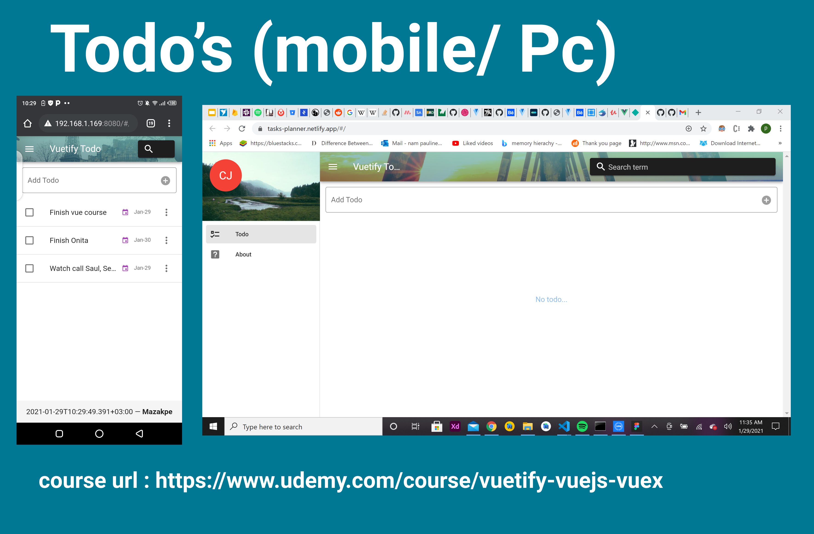

# vue-todo



## About
 An web app used to store my todo items. CRetaed using  Vuetify, along with Vue JS & Vuex.
 - [Link](https://tasks-planner.netlify.app/#/) - Open and test it.

## What i learnt in the process of building.
- How to create a beautiful app with Vuetify, Vue JS & Vuex
- How to move core data & logic into a Vuex Store with State, Mutations, Actions & Getters
- How to break the app up into Child Components
- How to use many Vuetify Components such as Lists, Text Fields, Dialogs, Date Pickers, Snackbars & Menus
- How to use Vue Router & Navigation Guards
- How to make data persist in the user's browser using IndexedDB & Localbase
- How to test & debug the app on real iOS & Android devices

## Course
- By Danny Connell => Indie App Developer & Instructor
- [vuetify-vuejs-vuex](https://www.udemy.com/course/vuetify-vuejs-vuex) - Enjoy the learning.

## Contact
If you need any help, you can connect with me. Im also open to build your ideas.

Visit:- [maku](https://www.linkedin.com/in/maku-mazakpe-700a3a165/)

## Project setup
```
npm install
```

### Compiles and hot-reloads for development
```
npm run serve
```

### Compiles and minifies for production
```
npm run build
```

### Customize configuration
See [Configuration Reference](https://cli.vuejs.org/config/).
